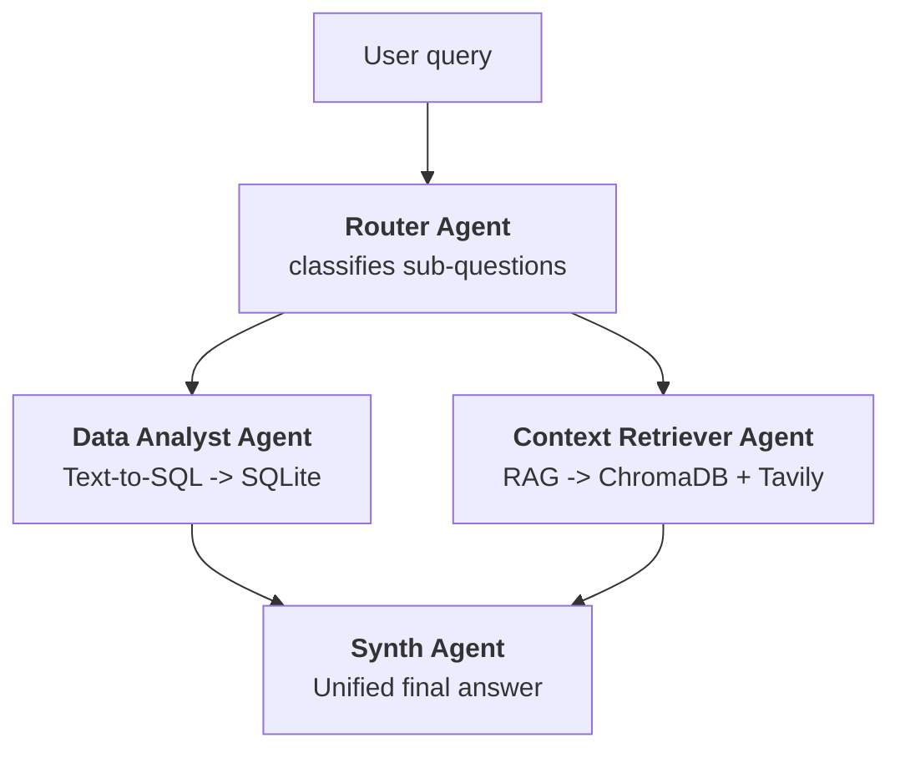

# Business Review Agent (DEMO for Cognitactix webinar)

A multi-agent AI system that generates executive Quarterly Business Reviews (QBR) by combining structured data analysis with qualitative context retrieval. Built with LangGraph, LangChain, and Streamlit.

## Overview

The agent answers questions about account health by routing each query to the right knowledge source and synthesizing the results:

- **Data Analyst** — text-to-SQL over a SQLite database (invoices, usage, subscriptions, health scores)
- **Context Retriever** — RAG over support tickets and account notes stored in ChromaDB, with Tavily web search as fallback
- **Router** — classifies the query, fans out to one or both agents in parallel, then synthesizes a unified answer




## Demo Dataset

The `files/` directory contains a synthetic QBR dataset for **Nimbus Cloud** (fictional B2B SaaS) covering Q1–Q2 2026 across six accounts:

| Account | Story | Key signal |
|---|---|---|
| **Acme** | High churn risk | Visible in both numbers AND tickets (P1 outages, champion left, evaluating competitor) |
| **Hooli** | Silent churn | Revenue flat, usage −37% — almost no tickets; only the analyst can catch it |
| **Initech** | Friction | Revenue flat, ticket noise around report bugs — only the RAG can explain it |
| **Globex** | Expansion | Revenue +17%, usage +15%, healthy |
| **Umbrella** | New logo ramping | Strong onboarding, usage +91% |
| **Soylent** | Star account | High revenue, high usage, low ticket volume |

> The Acme vs. Hooli contrast is the key demo moment: both renew in Q3-2026 and both are at risk, but one is loud and one is silent. Billing alone misses Hooli.

### Database schema (`files/qbr.db`)

| Table | Columns |
|---|---|
| `accounts` | account_id, name, industry, country, region, segment, csm_owner, contract_start, renewal_quarter, seats_contracted |
| `subscriptions` | account_id, product, plan_tier, seats, monthly_price |
| `invoices` | invoice_id, account_id, invoice_date, quarter, amount, status |
| `usage_monthly` | account_id, month, active_users, api_calls, logins, feature_adoption_score |
| `support_tickets` | ticket_id, account_id, created_date, quarter, channel, category, priority, status, csat, subject, description |
| `account_health` | account_id, quarter, nps, csat_avg, health_score |

Regenerate all data with a fixed seed: `python3 files/generate_qbr_data.py`

## Requirements

- Python 3.13+
- [uv](https://docs.astral.sh/uv/) (package manager)
- [LM Studio](https://lmstudio.ai/) running locally on `http://127.0.0.1:1234` with the `text-embedding-nomic-embed-text-v1.5` model loaded (used for embeddings)
- OpenAI API key
- Tavily API key

## Setup

**1. Install dependencies**

```bash
uv sync
```

**2. Configure environment variables**

Create a `.env` file in the project root:

```env
OPENAI_API_KEY=sk-...
TAVILY_API_KEY=tvly-...
```

**3. Start LM Studio**

Load the `text-embedding-nomic-embed-text-v1.5` model and start the local server on port `1234`.

## Running

### Streamlit chat UI

```bash
uv run streamlit run app/streamlit_app.py
```

### LangGraph dev server

```bash
uv run langgraph dev
```

The `langgraph.json` exposes three graphs: `main` (router), `context_retriever`, and `data_analyst`.

## Example Queries

**Structured (Data Analyst):**
- "Which accounts had a revenue drop from Q1 to Q2 2026?"
- "Show the percentage change in active users per account between Q1 and Q2."
- "Which accounts renew in Q3-2026 and what is their health score?"
- "Top 3 accounts by P1 ticket volume in Q2."

**Qualitative (Context Retriever):**
- "Why did the Acme account decline this quarter?"
- "What issue is concentrated in Initech's tickets?"
- "Is there any account showing silent churn?"

**Both agents (capstone):**
- "Generate the Q2-2026 business review: identify at-risk accounts with the numbers that support it and explain what is happening in each one."
